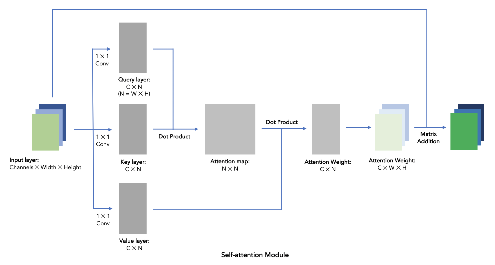
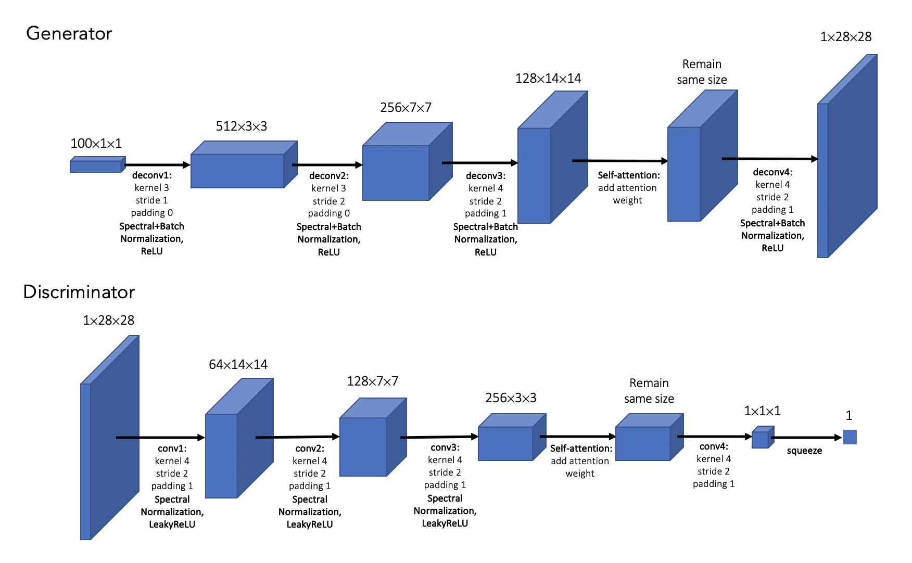

# Self-attention-DCGAN

***An application on the SAGAN from https://github.com/heykeetae/Self-Attention-GAN. I re-constructed part of code and added a 28 by 28 version running on mnist dataset.***

### Core files for running the code:

1. SAGAN_mnist.ipynb & SAGAN_celeba.ipynb: Notebooks interface containing codes for loading datasets, utility functions and training function.

2. model_28.py & model_64.py: Contains self-attention, Generator and Discriminator modules for 28 by 28 version and 64 by 64 version, respectively.

3. spectral.py: Containing spectral normalization module. Borrowed from https://github.com/heykeetae/Self-Attention-GAN. Can be removed given minor change in model.py.

### Self-attention module:

An idea that has been out there for years, until Google spoke for it in 2017 as mentioned below in paper [3]. It worked as the following steps in the case of images:

1. Using a kernel size 1 convo to generate Query, Key and Value layers, with the shape of Channels * N, N = Width * Height.

2. Generate attention map by the matrix dot product of Query and Key, with the shape of N * N. The N * N attention map describe each pixel's attention score on every other pixels, hence the name "self-attention". Pixels here mean data points in input matrices.

3. Get attention weights by the matrix dot product of Value and attention map, with the shape of C * N. The attention weights describe each pixel's total attention score throughout all pixels. We then reshape the attention weights into C * W * H.

4. Add the attention weights back onto input layer it self with a weight of Gamma, a learning parameter initializing at 0. It means that the self-attention module does not do anything initially.

### Model Structure:

1. For the 3 * 64 * 64 input case, I used a similar model setup from https://github.com/heykeetae/Self-Attention-GAN, with 2 attention layers in both G and D.

2. For the 1 * 28 * 28 input case, I built such model:

### Deep Convolutional GAN VS Self Attention GAN

### Referance:

[1] Han Zhang, Ian Goodfellow, Dimitris Metaxas, Augustus Odena: “Self-Attention Generative Adversarial Networks”, 2018;

Full paper: https://arxiv.org/pdf/1805.08318.pdf

[2] Xiaolong Wang, Ross Girshick, Abhinav Gupta, Kaiming He: “Non-local Neural Networks”, 2017; 

Full paper: https://arxiv.org/pdf/1711.07971.pdf

[3] Ashish Vaswani, Noam Shazeer, Niki Parmar, Jakob Uszkoreit, Llion Jones, Aidan N. Gomez, Lukasz Kaiser, Illia Polosukhin: “Attention Is All You Need”, 2017;

Full paper: https://arxiv.org/pdf/1706.03762.pdf
